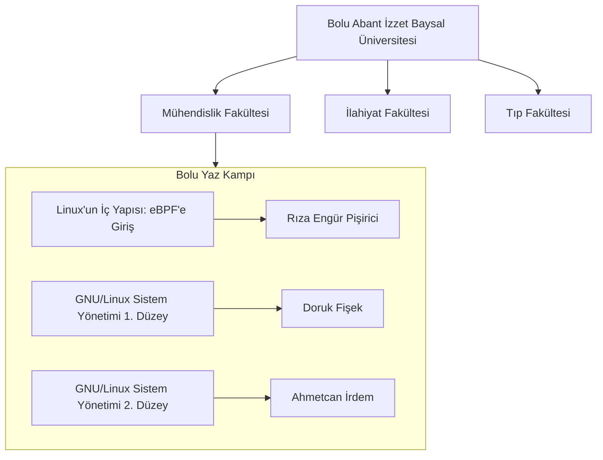
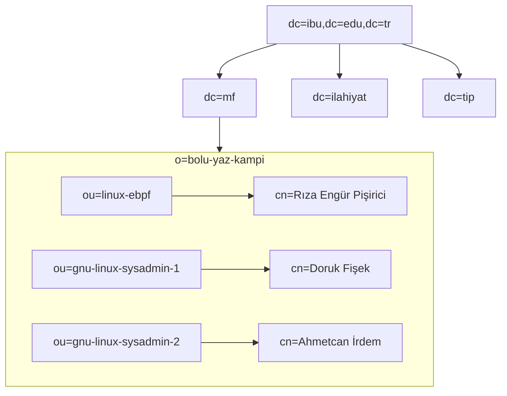

## Ağaç Yapısı Nedir?

- Ağaç Yapısı, verilerin hiyerarşik olarak organize edilmesi için kullanılan bir yapıdır. Gerçek hayattaki gibi ağacın dallanma mantığına benzer şekilde üstten alta doğru genişleyen mantıksal yapıyı temsil eder.

## Örnek Bir Ağaç Yapısı

## LDAP'ta Ağaç Yapısı ve Bazı Temel Bileşenleri

| LDAP Niteligi     | Nitelik Kodu | Nitelik Aciklamasi       |
| ----------------- | ------------ | ------------------------ |
| Country           | c            | Ülke                     |
| State             | st           | İl/Eyalet                |
| Domain Component  | dc           | Etki Alanı Öğesi         |
| Organization      | o            | Organizasyon Adı         |
| Organization Unit | ou           | Organizasyon Ünitesi Adı |
| Common Name       | cn           | Ortak İsim               |
| UserID            | uid          | Kullanıcı ID'si          |

## Örnek Ağaç Yapısının LDAP'ta Gösterimi

## Kaynaklar

- <https://bidb.itu.edu.tr/seyir-defteri/blog/2013/09/06/ldap-(lightweight-directory-access-protocol---hafifletilmi%C5%9F-dizin-eri%C5%9Fim-protokol%C3%BC)>
- <https://en.wikipedia.org/wiki/Tree_structure>
- <https://en.wikipedia.org/wiki/Directory_service>
- <https://www3.rocketsoftware.com/rocketd3/support/documentation/Uniface/10/uniface/dbmsSupport/dbmsDrivers/LDAP/concepts/LDAP_data_structure.htm>
