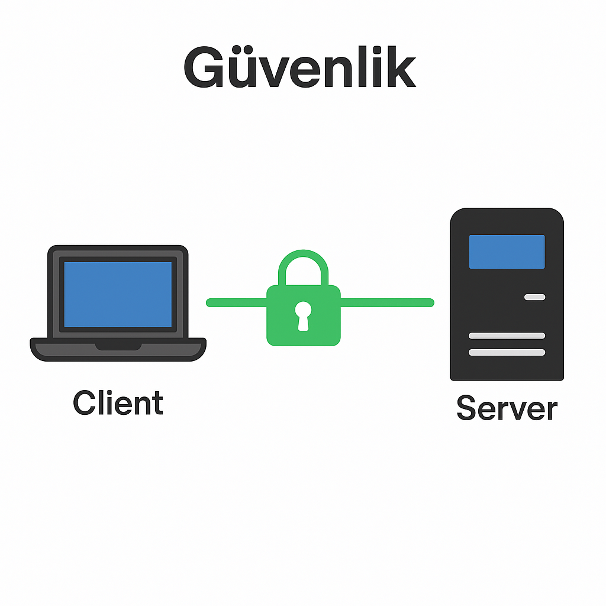

<!-- Slide number: 1 -->
# OpenLDAP Replikasyonu

Hazırlayan: [Tarık Kabak]

### Notes:

Bu sunumda OpenLDAP replikasyonunun ne olduğu, neden gerekli olduğu ve hangi senaryolarda nasıl uygulanabileceği ele alınmaktadır. Replikasyon, dizin servislerinin yüksek erişilebilirlik ve güvenilirlik sağlamasında kritik bir rol oynar. Büyük kurumlarda LDAP sadece kullanıcı kimlik doğrulaması değil, aynı zamanda e-posta, VPN, dosya paylaşımı gibi birçok servis için merkezî bir altyapıdır. Bu nedenle replikasyonun doğru tasarlanması, tüm sistemlerin sürekliliği açısından zorunludur.

<!-- Slide number: 2 -->
# Giriş

LDAP Nedir?
OpenLDAP’ın genel özellikleri
Replikasyonun önemi: Yüksek erişilebilirlik, Yedeklilik, Performans

### Notes:
LDAP, Lightweight Directory Access Protocol’ün kısaltmasıdır ve temel amacı dizin servislerine erişim sağlamaktır. OpenLDAP ise bu protokolün açık kaynak implementasyonudur. OpenLDAP replikasyonu, farklı coğrafi bölgelerde veya farklı sunucularda dizin verilerinin senkronize edilmesini sağlar. Replikasyonun önemi; sistemde tek bir hata noktasının (SPOF) olmamasını, performans artışını ve felaket senaryolarında hızlı toparlanmayı mümkün kılmasıdır.

<!-- Slide number: 3 -->
# Replikasyonun Temel Kavramları

Master ve Slave kavramları
Multi-Master yaklaşımı
Mirror Mode
Syncrepl mekanizması

### Notes:
OpenLDAP replikasyonunda üç ana kavram vardır: Master, Slave (Consumer) ve Multi-Master. Master sunucu yazma işlemlerini kabul eder, Slave ise kopya verilerle sadece okuma yapabilir. Multi-Master modelinde her sunucu hem yazma hem okuma yapabilir ve değişikliklerini diğerleriyle senkronize eder. Ayrıca OpenLDAP’ın Mirror Mode adı verilen, özellikle yüksek erişilebilirlik için kullanılan bir replikasyon türü vardır. Tüm bu süreçlerin altında yatan mekanizma ise Syncrepl’dir.

<!-- Slide number: 4 -->
# Replikasyon Modelleri

Single-Master Replication: Tüm yazma işlemleri Master üzerinde
Multi-Master Replication: Her node yazma/okuma yapabilir
Mirror Mode Replication: İki node sürekli eşlenir

### Notes:
OpenLDAP üç farklı model sunar:- Single-Master Replication: Basit, tek yazma noktası olan bir modeldir. Ancak master çökerse yazma işlemleri durur.- Multi-Master Replication: Tüm sunucular yazma yetkisine sahiptir. Çakışmaların yönetimi gerekir, ama yüksek erişilebilirlik sağlar.- Mirror Mode Replication: İki sunucu birbirinin yedeği olacak şekilde yapılandırılır. Genelde bir yük dengeleyici ile birlikte çalışır.Bu modellerden hangisinin seçileceği kurumun ihtiyaçlarına göre değişir.

<!-- Slide number: 5 -->
# Syncrepl Mekanizması

RefreshOnly vs RefreshAndPersist
Accesslog veritabanı
Master → Consumer veri akışı
Konfigürasyon örnekleri

### Notes:
Syncrepl, OpenLDAP replikasyonunun kalbidir. İki farklı çalışma şekli vardır: RefreshOnly (belirli aralıklarla güncelleme) ve RefreshAndPersist (sürekli güncel kalma). Accesslog veritabanı sayesinde değişiklikler takip edilir ve replikalar güncel tutulur. Syncrepl sayesinde Master sunucudaki tüm değişiklikler Consumer sunuculara otomatik olarak aktarılır. Bu süreçte bağlantı problemleri olsa bile sistem tekrar bağlandığında eksikler tamamlanır.

<!-- Slide number: 6 -->
# Kurulum ve Konfigürasyon

Gerekli paketler: slapd, ldap-utils
Master sunucu yapılandırması
Replica (Consumer) yapılandırması
Test ve doğrulama (ldapsearch, loglar)

### Notes:
Replikasyon için öncelikle gerekli paketlerin kurulması gerekir: slapd ve ldap-utils. Ardından Master sunucuda şema ve yapılandırma dosyaları hazırlanır. Consumer tarafında ise Syncrepl konfigürasyonu yapılır. Bu süreçte dikkat edilmesi gereken nokta, kullanıcı yetkilerinin doğru verilmesi ve binddn hesabının güvenli tanımlanmasıdır. Kurulum sonrası ldapsearch komutu ile test yapılır ve loglar incelenerek replikasyonun doğru çalıştığı teyit edilir.

<!-- Slide number: 7 -->
# Güvenlik

LDAPS (636) kullanımı
TLS sertifikaları
Bind kullanıcıları ve şifre güvenliği

### Notes:
LDAP replikasyonunda güvenlik büyük önem taşır. Tüm replikasyon trafiği şifrelenmiş olmalıdır. Bunun için LDAPS (636 numaralı port) veya STARTTLS kullanılabilir. Ayrıca Master ve Consumer arasında kullanılan bind kullanıcılarının şifreleri güçlü olmalıdır. Sertifika altyapısı (CA) ile TLS güvenliği sağlandığında verilerin üçüncü kişiler tarafından dinlenmesi engellenir.

<!-- Slide number: 8 -->
# İzleme ve Sorun Giderme

Log dosyalarının incelenmesi
Bağlantı testleri
Replikasyon gecikmeleri
Çakışma yönetimi

### Notes:
Replikasyon yapılarında en sık karşılaşılan problemler bağlantı hataları, gecikmeler ve veri çakışmalarıdır. Bu sorunları tespit etmek için log dosyaları (örn. /var/log/slapd.log) takip edilmeli, ldapsearch ve benzeri araçlarla test yapılmalıdır. Ayrıca monitoring yazılımları (Nagios, Zabbix) ile LDAP sunucuları izlemek faydalıdır. Çakışma yönetiminde, hangi sunucunun değişikliğinin geçerli olacağı politikası önceden tanımlanmalıdır.

<!-- Slide number: 9 -->
# Use Case 1: Üniversite Ortamı

Problem: Binlerce öğrenci/personel, farklı kampüslerde kimlik doğrulama ihtiyacı
Çözüm: Merkezde Master, kampüslerde Consumer sunucular
Fayda: Hızlı kimlik doğrulama, kampüs içi bağımsız çalışma, yedeklilik

### Notes:
Bir üniversitede on binlerce öğrenci ve personelin aynı anda farklı servisleri kullanması gerekir. Örneğin e-posta, kablosuz internet, LMS gibi sistemler LDAP üzerinden kimlik doğrulama yapar. Bu noktada merkezde bir Master sunucu, her kampüste Consumer sunucular kurularak sistem performanslı ve güvenli hale gelir. Öğrenciler kendi kampüslerindeki LDAP sunucusuna bağlanır, böylece ağ trafiği azalır ve sistem daha hızlı çalışır.

<!-- Slide number: 10 -->
# Use Case 2: Kurumsal Şirket (Multi-Site Yapı)

Problem: Şirketin farklı şehirlerde ofisleri var
Çözüm: Multi-Master OpenLDAP
Fayda: Kullanıcı yönetimi dağıtık yapılabiliyor, kullanıcı her ofiste aynı kimlikle giriş yapabiliyor

### Notes:
Birden fazla şehirde ofisi olan şirketlerde, kullanıcıların farklı lokasyonlarda aynı hesapla giriş yapabilmesi gerekir. Multi-Master replikasyon bu senaryo için idealdir. İstanbul ofisinde yapılan bir kullanıcı değişikliği, Ankara ve İzmir ofislerindeki LDAP sunucularına otomatik yansır. Böylece tüm kullanıcılar hangi şehirde olurlarsa olsunlar aynı kimlik bilgileriyle sorunsuz oturum açabilir. Bu yapı, dağıtık yönetim esnekliği de sağlar.

<!-- Slide number: 11 -->
# Use Case 3: Finans Kurumu (Yüksek Erişilebilirlik)

Problem: VPN, e-posta gibi kritik servisler LDAP’a bağımlı
Çözüm: Mirror Mode Replication + Load Balancer
Fayda: Kesintisiz hizmet, tek sunucu arızasında bile sistem devam ediyor

### Notes:
Finans kurumları için kesinti kabul edilemez. VPN erişimi, e-posta ve intranet gibi sistemler LDAP’a bağımlı olduğunda, tek bir sunucunun çökmesi tüm çalışanların erişimini engelleyebilir. Bu nedenle Mirror Mode Replication kullanılır. İki sunucu sürekli birbirini yedekler ve bir Load Balancer (örn. HAProxy) üzerinden gelen istekler aktif olan node’a yönlendirilir. Böylece bir sunucu çökse bile sistem kesintisiz çalışmaya devam eder.

<!-- Slide number: 12 -->
# Sonuç ve Öneriler

Senaryoya uygun replikasyon modeli seçilmeli
Performans ↔ Güvenlik dengesi gözetilmeli
OpenLDAP, ölçeklenebilir ve esnek bir çözüm sunar

### Notes:
Replikasyon modeli seçimi kurumun ölçeğine, kritik servislerine ve güvenlik ihtiyaçlarına göre yapılmalıdır. Küçük yapılarda Single-Master yeterli olabilirken, çok lokasyonlu yapılarda Multi-Master veya yüksek erişilebilirlik gerektiren yapılarda Mirror Mode daha uygun olur. OpenLDAP, açık kaynak yapısı sayesinde esnek ve güçlü bir çözüm sunar. Doğru planlama ve güvenlik tedbirleriyle uzun yıllar stabil çalışabilir.

